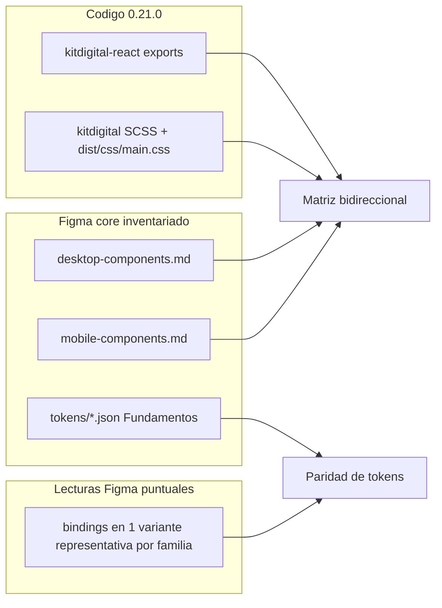

# Plan: reporte de paridad código Kit Digital vs Figma USS

Alcance cerrado: **solo el sistema principal** ([USS Design System Inventory/](../USS%20Design%20System%20Inventory/README.md)), **código = npm fijado** `@ussebastian/kitdigital-react` + `@ussebastian/kitdigital` **0.21.0**, profundidad = **presencia + ejes de variante + tokens visuales**.

Los archivos Figma del core siguen **solo lectura** ([decisions/012](../decisions/012-local-library-consolidation-scope.md)). USS One y Extension Library quedan fuera.

## Qué ya existe (no rehacer)

El cruce de [context/code-design-mapping.md](../context/code-design-mapping.md) es **solo de presencia**, y ya está desactualizado como “el” reporte:

- **23/26** exports React tienen página Figma en Desktop **y** Mobile.
- Empaque, no hueco: `AspectRatio` / `OpacityLayer` / `Icon` son propiedad o `INSTANCE_SWAP`.
- `Form` es many-to-one (7 páginas Figma).
- Figma-only ya identificados: **Navigation stack**, **Sheets** (Desktop); Empty state **ausente** del core.
- Tokens: colores semánticos coinciden; spacing/radius divergen; H4 weight y Display size divergen ([item 10](../reports/figma-data-quality-issues.md), [item 6](../reports/figma-data-quality-issues.md)).
- Inventarios listos: Desktop 32/106/920, Mobile 30/93/776, Fundamentos 169 vars + estilos. **No re-extraer** ([state/inventories.md](../state/inventories.md)).

Eso no alcanza para el reporte pedido: falta el **sentido inverso** (página Figma sin código), **paridad de ejes** (Estado, Tamaño, dark mode, Desktop vs Mobile) y **tokens por componente**.

## Bloqueador inmediato

`node_modules/@ussebastian/` **no está instalado** en este workspace. Primer paso: `npm install` para reproducir el pin de [package.json](../package.json) / lockfile ([decisions/009](../decisions/009-pin-code-library-reference.md)). Sin eso no hay catálogo de código verificable.

## Fuentes a usar (y cuáles no)

- Código: exports React (`src/` o `dist/components/`), hojas SCSS por componente, CSS compilado (fuente de verdad de tokens, no solo SCSS: ya vimos source ≠ `main.css`).
- Diseño: tablas ya escritas en los dos `components/*.md` + `tokens/{spacing,radius,colors,typography,effects}.json`.
- Figma MCP: **solo** para resolver bindings de variables en **una instancia representativa** por familia (p. ej. Button primary Default light Desktop + Mobile). No volver a listar las 46/44 páginas. Canal: `use_figma` / `get_variable_defs` en nodeId concreto; `get_metadata` sin nodeId **no** es catálogo.
- Docs site del Kit: solo para confirmar API (imperative vs declarative), no como inventario.

Fuera de alcance: Testing de librerías locales, Patterns no escaneados (`Filters`, `Forms` se listan como “composición, no deep-scan”), editar Figma, re-pin de npm.

## Trabajo en tres capas

### 1. Catálogo de código (tras `npm install`)

Construir la lista canónica de la librería de patrones, en dos superficies (el Kit no es un solo paquete):

- **React:** los 26 exports ya citados + cualquier otro export que aparezca en `dist/components/` (Avatar, EmptyState, Sheet, etc., si existieran).
- **CSS-only:** clases `.uss-*` en `dist/css/main.css` que no tengan export React (tipografía semántica, form internals, utilities). Ya sabemos que no hay API JS de Typography/Theme.

Salida interna: una tabla `code_id | react_export | css_root | notes`. No pegar dumps grandes; agrupar por familia ([decisions/001](../decisions/001-adaptive-compression.md)).

### 2. Matriz bidireccional de presencia + variantes

Unión de: páginas core Figma (32 Desktop / 30 Mobile) + exports React + CSS-only relevantes.

Columnas mínimas por fila:

- Figma Desktop (sí / no / solo Desktop)
- Figma Mobile (sí / no)
- React export
- Clase CSS raíz
- Ejes Figma vs props/clases código (Estado, Tamaño, Tipo, dark mode)
- Veredicto: `match` | `packaging` | `figma_only` | `code_only` | `axis_drift` | `token_drift`

Ejes ya documentados que hay que **verificar en código**, no re-descubrir en Figma:

- Buttons: Desktop 5 estados (con Hover) vs Mobile 4 (salvo full width) — [item 14](../reports/figma-data-quality-issues.md).
- Cards: variantes `(solo Desktop)` vs un `Card` React.
- Accordion Desktop incluye Hover en Group row; Mobile no.
- Tags: `type=navigation|toggle` en Desktop; Mobile más estrecho.
- Form: 7 páginas Figma vs un `Form` + subcomponentes / clases `.uss-form__*`.

Filas Figma-only esperadas (confirmar contra CSS): Navigation stack, Sheets, Image/video (salvo AspectRatio como prop), Slot / Separador / secciones.

### 3. Tokens visuales (Fundamentos + muestra por familia)

**Fundamentos (sin reabrir Figma):** cruzar `tokens/*.json` del core contra `--*` en `dist/css/main.css` + `_variables.scss`. Cubrir las 5 categorías. Reusar hallazgos ya escritos (spacing 36/112, radius-full 9999, type H4/Display). Completar lo que el mapping **no** tabuló: effects/elevación, rampa base 10-step, semantic dark.

**Por componente:** no 920+776 variantes. Una variante representativa light (y dark si el set lo expone) en Desktop y, si el eje Mobile diverge, otra en Mobile. Leer bindings (`get_variable_defs` / Plugin API read-only) y comparar con las custom properties de la clase CSS equivalente.

Familias a muestrear (prioridad): Button, Form/Text field, Card, Header, Modal, Table, Tabs, Tag, Alert, Toast. El resto: presencia + ejes; tokens solo si el muestreo de la familia “padre” no cubre.

## Entregables

Según [decisions/014](../decisions/014-author-external-skill-deliverable.md):

- **Reporte** en [`reports/uss-kit-figma-component-parity.md`](../reports/uss-kit-figma-component-parity.md) (auditoría diseño↔código, no steering de consumidor).
- **Resumen durable** en [context/code-design-mapping.md](../context/code-design-mapping.md) (reemplazar la tabla de 23/26 por puntero a la matriz completa; no duplicar 50 filas).
- **Canvas** `uss-kit-figma-parity` (matriz + stats + callouts de drift). Un canvas nuevo: no está atado a un inventario único, misma excepción que `consolidation-status-report`.
- **Skill** [`skills/code-design-audit.md`](../skills/code-design-audit.md): [decisions/009](../decisions/009-pin-code-library-reference.md) ya lo pidió cuando el cruce se volviera recurrente.
- Cierre de sesión: `decisions/024`, `logs/` siguiente, filas en [state/current.md](../state/current.md) y [context/decisiones.md](../context/decisiones.md). Items nuevos de calidad → append en [reports/figma-data-quality-issues.md](../reports/figma-data-quality-issues.md), sin silenciar anomalías.

No tocar `deliverables/kitdigital-v1.md` / `-v2.md` salvo que el reporte descubra una regla ya usada ahí que haya que corregir.

## Orden de ejecución

1. `npm install` y listar exports + `.uss-*` (código primero).
2. Armar la unión Figma↔código desde los `.md` de inventario (cero Figma).
3. Cruce de tokens de Fundamentos vs CSS (cero Figma).
4. Lecturas Figma **puntuales** de bindings, en paralelo, una por familia.
5. Escribir reporte + canvas + mapping + skill + memoria.
6. `scripts/validate-dod.ps1` (inventarios no cambian de forma; el hook igual corre).

## Criterio de hecho

El reporte responde, en ambas direcciones: qué está en la librería de patrones y no en el Kit UI Figma; qué está en Figma y no en código; dónde coinciden el nombre pero no los ejes; dónde coinciden los ejes pero no el token resuelto. Cada celda cita archivo (`desktop-components.md`, clase CSS, o nodeId de la muestra), no conversación previa.

## Result (2026-09-25)

Executed. Artifacts: [`reports/uss-kit-figma-component-parity.md`](../reports/uss-kit-figma-component-parity.md), canvas `uss-kit-figma-parity`, [`skills/code-design-audit.md`](../skills/code-design-audit.md), [`decisions/024`](../decisions/024-uss-kit-figma-component-parity.md), [`logs/022`](../logs/022-uss-kit-figma-parity.md).
